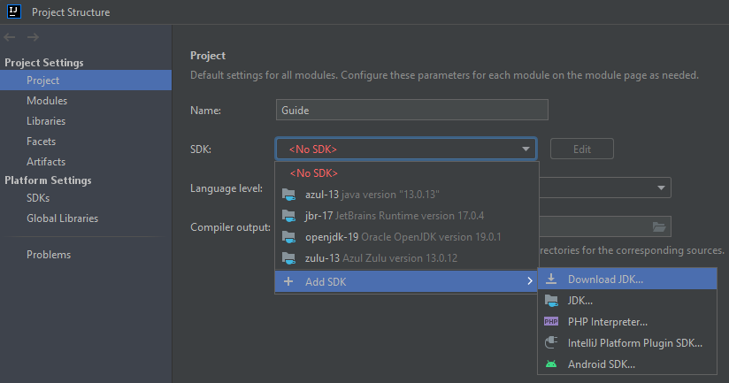
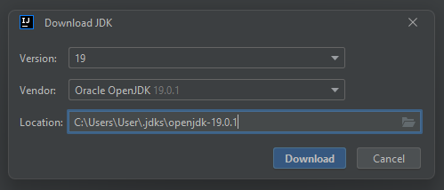
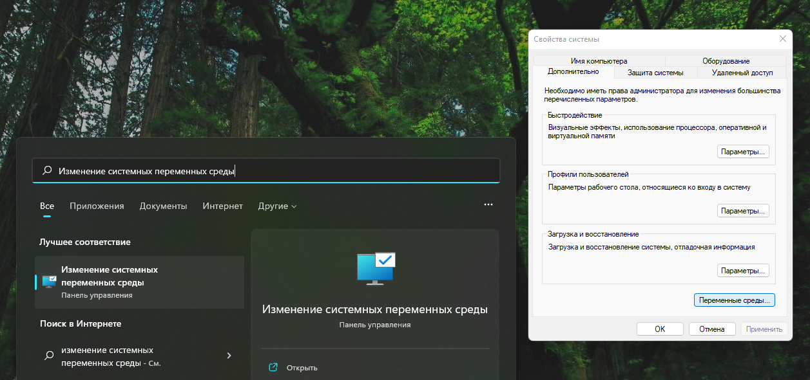
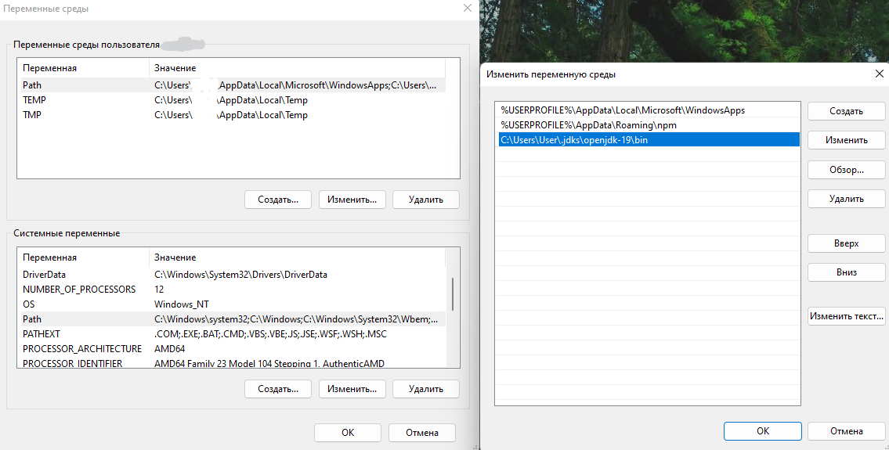
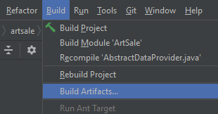
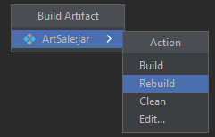
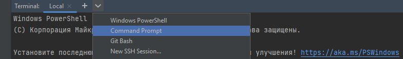

# Вечер в хату, второгодники.

Для наиболее успешной сдачи курсача, я решил ебануть гайд как не обосраться в течение всего пути.

Придерживайтесь его и всё будет заебись.

## 1. Готовим себя и компьютер

### Список необходимого софта:

- Винда 7/10/11
- Хром, чтобы оперативно гуглить
- IntelliJ IDEA Ultimate с оф сайта

  (хотя сойдёт и Community)
- H2 Database

### Проверяем ПК и настраиваем Java:

1. Берём спирт и заливаем в себя.

   Можно немного оставить, чтобы стереть старую термопасту и намазать новую _(не наоборот)_.
2. Врубаем комп, открываем хром и идею.

   <details> 
     <summary>Если этот процесс занял более 2 минут на HDD и более 30 секунд на SSD</summary>

   **Сносим винду к херам и переустанавливаем**

   _А ВООБЩЕ-ТО ЭТО БЛЯДЬ ЕЩЁ ПЕРЕД НАЧАЛОМ КАЖДОГО УЧЕБНОГО ГОДА НАДО БЫЛО ДЕЛАТЬ_
    - Качаем ЧИСТУЮ ОФИЦИАЛЬНУЮ ВИНДУ с сайта майкрософт. Никаких сборок _BASS BOOSTED BY VASYAN_.
    - Активация любой винды тремя командами в cmd:
        - [Windows 10](https://msguides.com/windows-10)
        - [Windows 11](https://msguides.com/windows-11)
    - При переустановке выбираем редакцию PRO.
    - **ФОРМАТИРУЕМ** системный диск, никаких переносов данных и частичной установки.
    - После установки удаляем в пуске и панели управления всё, что удаляется.
   </details>

3. В идее открываем проект, открываем `Project Structure` (жмём `CTRL+ALT+SHIFT+S`), слева выбираем вкладку `Project`,
   справа в SDK видим версию `OpenJDK 19`. Если нет, то тыкаем `Add JDK` > `Download JDK` > `Oracle OpenJDK`.

   
   

4. Пишем в пуске `Изменение системных переменных среды`, тыкаем на первый попавшийся пункт, в появившемся окне нажимаем
   на кнопку `Переменные среды` (самая нижняя).

   

    - В верхней половине окна `Переменные среды пользователя` выбираем `Path`.
    - Проверяем, чтобы в её путях не было никаких намёков на Java.
    - Если есть какие-то версии Java, удаляем путь. Желательно подчистить их
      в `Панели управления` > `Установка и удаление программ`, если они там есть. Если нет — просто удалить папки в
      проводнике.
    - Указываем расположение установленной OpenJDK, обычно чёт типо `C:\Users\User\.jdks\openjdk-19\bin`
    - В нижней половине окна тоже выбираем `Path`
    - Тоже проверяем отсутствие посторонних Java, подчищаем, если есть.

   **Если этого не сделать, то версии Java будут конфликтовать — проект может билдиться, но могут появиться ошибки при
   запуске JAR.**

     

5. Открываем командную строку или терминал, пишем `java --version`. Если 4 пункт выполнен верно, выведет:
   ```
   C:\Users\User>java --version
   openjdk 19.0.1 2022-10-18
   OpenJDK Runtime Environment (build 19.0.1+10-21)
   OpenJDK 64-Bit Server VM (build 19.0.1+10-21, mixed mode, sharing)
   ```

**После всего этого все ваши проекты должны работать и запускаться без проблем.**

## 2. Берём халявную лицуху IDEA Ultimate на год

1. Регистрируемся на сайте JetBrains используя любой вариант.
2. Идём на https://www.jetbrains.com/shop/eform/students

   И заполняем заявку. Способ подачи — электронный адрес, указываем почту ЮФУ, получаем письмо с активацией.
3. Установленную идею регистрируем с помощью JB Account, тупа залогиниться надо вроде.

## 3. Проверяем работоспособность проекта

1. Открываем проект.
2. Открываем H2 Console. Откроется админка в браузере. Ничего в ней не меняем, нажимаем "Соединиться". Если увидели
   базу (даже пустую), то это успех.

**Если не запустить H2, то все тесты JDBC повалятся, но можно прогонять тесты XML и CSV**

Закрыть H2 можно в трее.

### Компиляция JAR

Если внесены какие-то изменения в код:

- В заголовке окна нажимаем `Build`
- Выбираем пункт `Build Artifacts`

  

- Во всплывшем окошке нажимаем `Rebuild`

  

### Запуск JAR

1. Открываем терминал внизу
2. Пишем туда команды для запуска из ReadMe, что-то типа:

   `java -jar JarName.jar JDBC command`
    - JarName — название .jar файла

      (он лежит в файлах проекта слева, обычно назван как проект)
    - JDBC/XML/CSV — выбор датапровайдера
    - command — команды из ReadMe
    - В конце могут быть ещё аргументы, они описаны в ReadMe
3. Если надо указать кастомные параметры `log4j2` и/или `environment`, кидаем их копии в корень проекта и запускаем, как
   указано в ReadMe, например:
   ```
   java -jar -Denv=./environment.properties -Dlog4j2.configurationFile=./log4j2.xml ./JarName.jar JDBC command
   ```
4. Если что-то идёт не так и консоль отрыгивает ошибки, то надо выбрать Command Prompt вместо PowerShell.

   

### Запуск тестов

1. Открываем `src\test\java\AbstractTest`
2. Слева от каждого тесткейса есть кнопка `Run`
3. После её нажатия можем выбрать датапровайдер, для которого выполнится тест.
4. Для запуска всех тесткейсов подряд можно нажать `Run` слева от названия класса и выбрать нужный датапровайдер, или
   прогнать тесты для всех.

### Если надо запустить какой-нибудь код

1. Открываем `src\test\java\TestArea`
2. Видим функцию `test()`
3. Пишем в теле функции всё, что хотим, запускаем кнопкой слева.
   ```
   void test() {
       log.info('Hello');
       <...>
   }
   ```

### Вроде описал все важные и полезные моменты.

По мере появления вопросов мб буду дописывать инструкцию.